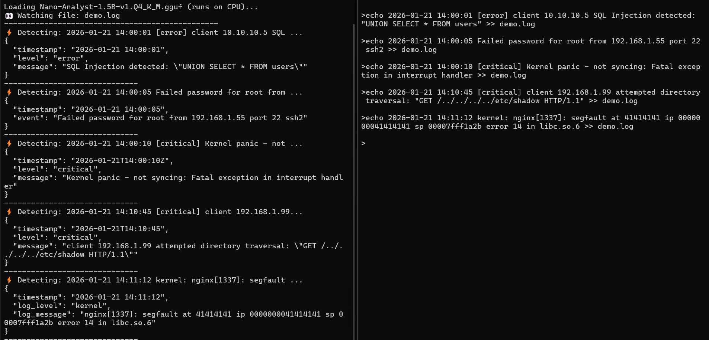

# 🛡️ Nano-Analyst: Zero-Cost Edge Security Intelligence
  

**Nano-Analyst** is a specialized "Small Language Model" (SLM) designed to run on low-resource edge devices (like Raspberry Pi or standard Laptops). It parses unstructured cybersecurity logs into structured JSON in real-time, eliminating the need for expensive cloud APIs.

---
<div align="center">
  
  <p><em>Real-time detection of SQL Injection, Kernel Panics, and Buffer Overflows on CPU.</em></p>
</div>

## 🏗️ Architecture: The Distillation Pipeline

This project implements a **Teacher-Student Distillation** workflow:

1.  **Teacher (Qwen2.5-7B):** Generated high-quality synthetic cybersecurity logs and "Gold Standard" JSON extractions.
2.  **Student (Qwen2.5-1.5B):** Fine-tuned via **QLoRA** on the synthetic dataset to learn extraction logic.
3.  **Edge Deployment:** The student model was fused and quantized to **GGUF (4-bit)** format to run on CPU.

---

## ⚡ Performance

| Metric | GPT-4o (Cloud) | Nano-Analyst (Edge) |
| :--- | :--- | :--- |
| **Cost** | ~$5.00 / 1M tokens | **$0.00** |
| **Privacy** | Data leaves premise | **100% Local** |
| **Latency** | Network Dependent | **<50ms / log** |
| **Hardware** | H100 GPU Cluster | **Standard CPU (1GB RAM)** |

---

## 🚀 Quick Start

### 1. Installation

```bash
# Clone repo
git clone https://github.com/SinanSamah/nano-analyst.git
cd nano-analyst

# Install dependencies (CPU optimized)
pip install llama-cpp-python
```

### 2. Run the Sentinel

Nano-Analyst behaves like `tail -f` but with intelligence. Point it at any log file:

```bash
# Watch a live server log
python nano.py watch /var/log/auth.log
```

### 3. Single Scan

```bash
python nano.py scan "Oct 25 sshd[123]: Failed password for root from 192.168.1.5"
```

---

## 🛠️ Tech Stack

- **Unsloth:** For ultra-fast QLoRA fine-tuning.
- **Llama.cpp:** For quantizing and running the model locally.
- **Qwen2.5:** State-of-the-art base models.
- **Python:** For the custom CLI wrapper.
